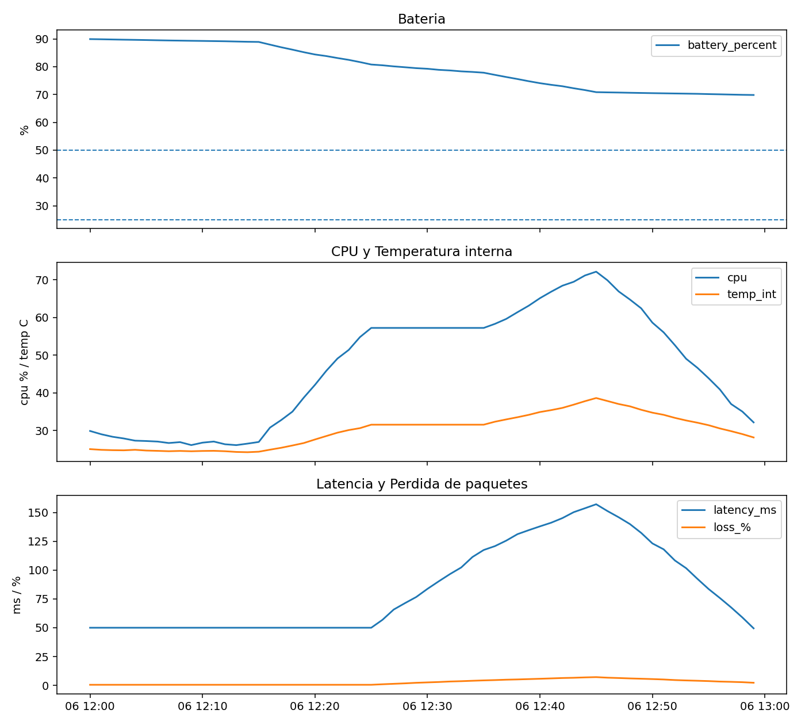

# LEO Ops Console

Mini mission operations lab for simulated LEO satellite telemetry.

This project turns one hour of simulated satellite telemetry into alerts, priorities, and one actionable recommendation.

**Pipeline:** telemetry → thresholds → trends → composite alerts → severity → recommendation → ops console

## What it does

- Generates realistic telemetry for 8 signals (power, thermal, link, CPU)
- Visualizes the mission in a dashboard
- Detects early degradation with trend windows
- Diagnoses multi-signal risk patterns
- Ranks alerts by severity
- Outputs one current operational recommendation

## Why it exists

Remote systems fail in motion, not only at a red threshold.
This lab is about operating a system you cannot touch: watch signals, detect syndromes, and decide what to do first.

## Dashboard



## Sample mission result

In the current 60-minute simulation:

- Dominant risk: **link degradation**
- Max severity: **3/5**
- Active recommendation: **reduce data rate and prioritize essential telemetry**

## How to run

```bash
pip install -r requirements.txt
cd Satelite
python telemetry_dashboard.py
python trend_alerts.py
python composite_alerts.py
python priority_engine.py
python recommendation_engine.py
python mission_report.py

leo-ops-console/
├── README.md
├── requirements.txt
└── Satelite/
    ├── telemetry_hour.csv
    ├── telemetry_dashboard.py
    ├── telemetry_dashboard.png
    ├── trend_alerts.py
    ├── composite_alerts.py
    ├── priority_engine.py
    ├── recommendation_engine.py
    └── mission_report.py

Pipeline

Generate / load time-series telemetry
Flag simple threshold alerts
Detect 5-minute trends
Build composite syndromes
Rank by severity
Issue one current action

What this demonstrates

Systems thinking
Time-series monitoring
Operational decision-making
Clean problem-to-action design

Status
Educational lab / portfolio project.
Next step: root-cause hints and a lightweight web console.
Author
Diego F. Palomino
